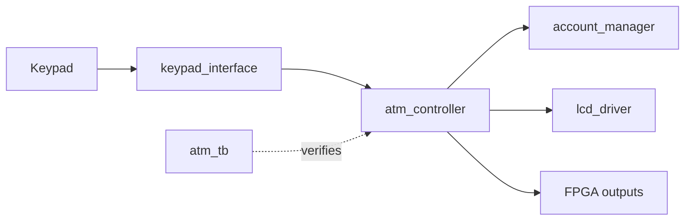

# FPGA ATM Controller (Verilog)

A modular Verilog implementation of a simplified ATM workflow for FPGA practice. It demonstrates PIN entry, authentication, menu selection, deposits, withdrawals, balance updates, and LCD feedback using a keypad-driven finite-state machine.

## Features

- PIN-based authentication and transaction flow.
- Deposit and withdrawal handling with balance checks.
- Matrix keypad input with input conditioning/debounce.
- 16×2 LCD controller for prompts and results.
- Account state separated from transaction sequencing.
- Testbench covering controller and transaction behavior.

## Architecture



| Module | Responsibility |
| --- | --- |
| `atm_top.v` | Top-level wiring and board-facing signals |
| `keypad_interface.v` | Keypad scanning/decoding and user-input events |
| `debounce.v` | Filters unstable button/key signals |
| `atm_controller.v` | FSM for login, menu, and transaction flow |
| `account_manager.v` | PIN/account state and balance operations |
| `lcd_driver.v` | LCD initialization and character output |
| `atm_tb.v` | Simulation testbench |

## Workflow

The controller waits for user input, collects a PIN, checks authentication, and then accepts a transaction choice. Deposit amounts update the balance; withdrawals are accepted only when funds are sufficient. The LCD reports prompts and outcomes. Exact PIN, reset behavior, clock timing, and board pin mapping should be confirmed in the HDL and the target board constraints before hardware use.

## Tools and hardware

- Verilog HDL
- Xilinx Vivado (the project context uses an Artix-7 FPGA board; adapt constraints for your board)
- Optional HDL simulator such as Vivado Simulator or ModelSim
- 4×4 keypad and 16×2 LCD for the intended hardware interface

## Simulate

Open the Verilog sources in Vivado or another Verilog simulator. Add `atm_tb.v` as a simulation source/testbench and select it as the simulation top. Run behavioral simulation and inspect the waveform for authentication, menu transitions, and transaction outcomes.

A generic Icarus Verilog compile/run command, if installed:

```bash
iverilog -g2012 -s atm_tb -o atm_sim atm_tb.v atm_top.v atm_controller.v account_manager.v keypad_interface.v debounce.v lcd_driver.v
vvp atm_sim
```

## Synthesize for a board

1. Add synthesizable modules to the Vivado project.
2. Set `atm_top` as the synthesis top.
3. Add a constraints file for the exact board pins and I/O standards.
4. Confirm clock frequency, reset polarity, LCD timing, and keypad wiring.
5. Run synthesis, implementation, and timing checks before programming the board.

The repository does not include a board-independent pin assignment file. Do not reuse constraints from another FPGA model without checking its pinout and I/O voltage.
